# Individually Addressable LED Candles — Inline "Dead Bug" Wiring Guide

This guide details the wiring and assembly for individually addressable **WS2812B LED candles** driven by a Raspberry Pi 4/5, using an inline **"Dead Bug" soldered logic level shifter** to step up the Raspberry Pi's 3.3V GPIO signal to 5.0V logic.

---

## 🛒 Bill of Materials & Hardware Components

| Component | Description | Amazon Link |
|---|---|---|
| **Addressable LEDs** | BTF-LIGHTING WS2812B Pre-Soldered / Diffused 5V RGB LEDs | [Amazon Product Link](https://www.amazon.com/dp/B07C1XGD1X?ref=ppx_yo2ov_dt_b_fed_asin_title&th=1) |
| **Level Shifter** | 3.3V to 5V Bi-Directional Logic Level Converter Module | [Amazon Product Link](https://www.amazon.com/dp/B08R6BCSYC?ref=ppx_yo2ov_dt_b_fed_asin_title) |
| **Protection Resistor** | 330 Ω 1/4W Resistor (placed inline on 5V Data line) | Standard Electronic Component |
| **Capacitor** | 1000 µF 10V/16V Electrolytic Capacitor (across 5V & GND near Pi) | Optional / Recommended |
| **Heat Shrink** | 2mm & 6mm Dual-Wall Adhesive Heat Shrink Tubing | Standard Hardware |

---

## 🪲 What is "Dead Bug" Wiring?

A **"Dead Bug"** setup means soldering wires directly to the pins of the tiny logic level converter module with its component pins pointing upward (resembling an upside-down dead bug), insulated with heat-shrink tubing, and embedded directly inside the wire harness. 

### Why Use Dead Bug Wiring for the Skull?
* **Zero Space Impact**: Eliminates bulky breadboards or extra PCBs inside the skull chassis.
* **Inline Protection**: Allows the level shifter to sit invisibly inside the wire loom between the Pi GPIO header and the candle harness.

---

## 📌 SN74AHCT125N DIP-14 IC Pinout & Dead-Bug Map

If using the **SN74AHCT125N** high-speed 3.3V-to-5.0V bus buffer IC in DIP-14 format (instead of a breakout module), use the following pinout and dead-bug connection map.

### DIP-14 Package Pinout Diagram

```text
               SN74AHCT125N DIP-14 Top View
                     ┌───┬───┐
(GND Enable 1)  1OE 1│●  └── │14 VCC (5V Power)
(3.3V Data IN)   1A 2│       │13 4OE (Tie to GND)
(5V Data OUT)    1Y 3│       │12 4A  (Unused)
(Tie to GND)    2OE 4│       │11 4Y  (Unused)
(Unused)         2A 5│       │10 3OE (Tie to GND)
(Unused)         2Y 6│       │9  3A  (Unused)
(Ground)        GND 7│       │8  3Y  (Unused)
                     └───────┘
```

### SN74AHCT125N Dead-Bug Pin Connection Table

| (1) Pi Pin # | (2) Dead Bug Pin # | (3) Dead Bug Pin Name | (4) Selected Wire Color |
|---|---|---|---|
| Pin 2 | Pin 14 | VCC | Red |
| Pin 9 | Pin 7 | GND | Black |
| — | Pin 1 | 1OE | Bare Solder Bridge (Pin 7) |
| Pin 12 | Pin 2 | 1A | Green |
| Candle 1 DIN | Pin 3 | 1Y | White (via 330 Ω resistor) |
| — | Pins 4, 10, 13 | 2OE, 3OE, 4OE | Bare Solder Bridge (Pin 7) |
| — | Pins 5, 6, 8, 9, 11, 12 | 2A, 2Y, 3A, 3Y, 4A, 4Y | None |

---

## 💡 Resistor Location & 3.3V Power vs. Data Pin Clarification

### 1. Where Does the 330 Ω Resistor Go?
> [!IMPORTANT]
> The **330 Ω resistor is placed ONLY on the 5.0V Data Output line** (`1Y` on the IC / `HV1` on the module), **BEFORE Candle 1's `DIN` pin**.
> - **Input Side (3.3V)**: Connect Raspberry Pi GPIO 18 (Pin 12) **directly** to Data Input (`1A` on the IC / `LV1` on the breakout module). **No resistor is used on the 3.3V input side.**
> - **Output Side (5.0V)**: Connect Data Output (`1Y` / `HV1`) ➔ **330 Ω Resistor** ➔ **Candle 1 DIN**. (This dampens signal reflections and protects the first LED).

### 2. Why Does Breakout Module Have `LV (3.3V VCC)` While SN74AHCT125N Does Not?
- **4-Channel MOSFET Breakout Module**: Requires a 3.3V power reference wire connected to its `LV` pin to bias internal transistors.
- **SN74AHCT125N IC Chip**: Powered **exclusively by 5.0V `VCC` (Pin 14)**. It has TTL-compatible input thresholds ($V_{IH} \ge 2.0\text{V}$), so it recognizes 3.3V GPIO data signals on Pin 2 (`1A`) directly **without needing any 3.3V power wire!**

---

## 🔌 Complete Wiring Pinout Table

### 1. SN74AHCT125N IC ➔ WS2812B Candle LED Chain

| Level Converter Output Pin | Connection | Destination |
|---|---|---|
| **Pin 3 (1Y Data Output)** | 330 Ω Resistor ➔ | **DIN** (Data In) of **Candle 1** |
| **Pin 14 (5V Rail Pass-through)** | Direct ➔ | **+5V** (VCC) of **ALL Candles** (Parallel Bus) |
| **Pin 7 (GND Pass-through)** | Direct ➔ | **GND** of **ALL Candles** (Parallel Bus) |

### 3. Daisy-Chaining Candle LEDs in Series (Data Line)

| Source LED | Signal Out | Destination LED | Signal In |
|---|---|---|---|
| **Candle 1** | **DOUT** (Data Out) | ➔ **Candle 2** | **DIN** (Data In) |
| **Candle 2** | **DOUT** (Data Out) | ➔ **Candle 3** | **DIN** (Data In) |
| **...** | **...** | ➔ **...** | **...** |
| **Candle 9** | **DOUT** (Data Out) | ➔ **Candle 10** | **DIN** (Data In) |

> [!IMPORTANT]
> - Power (`+5V`) and **GND** are wired in **parallel** to all 10 candle LEDs.
> - Data (`DIN` / `DOUT`) is wired in **series** (daisy-chained) from Candle 1 through Candle 10.

---

## 📐 Circuit Schematic Diagram

```mermaid
graph TD
    subgraph Pi ["Raspberry Pi 4 / 5 Header"]
        P5V["5V Power (Pin 2 / 4)"]
        PGND["GND (Pin 6 / 9 / 14)"]
        GPIO18["GPIO 18 / PWM0 (Pin 12)"]
    end

    subgraph DeadBug ["Inline Dead-Bug Level Shifter (SN74AHCT125N)"]
        HV["VCC 5V (Pin 14)"]
        GND_S["GND (Pin 7)"]
        LV1["1A Input (Pin 2)"]
        HV1["1Y Output (Pin 3)"]
    end

    subgraph Protection ["Inline Protection"]
        R330["330 Ω Resistor"]
    end

    subgraph Candles ["Addressable Candle Chain"]
        C1["Candle 1 (WS2812B)"]
        C2["Candle 2 (WS2812B)"]
        C10["Candle 10 (WS2812B)"]
    end

    P5V -->|Red Wire| HV
    PGND -->|Black Wire| GND_S
    GPIO18 -->|Green Wire| LV1

    HV1 --> R330
    R330 -->|5V Data Line| C1

    P5V -->|+5V Bus| C1
    PGND -->|GND Bus| C1

    C1 -->|DOUT to DIN| C2
    C2 -->|DOUT to DIN| C10
```



---

## 🛠️ Step-by-Step "Dead Bug" Assembly Instructions

### Step 1: Prepare the Level Shifter IC (SN74AHCT125N)
1. Place the 14-pin DIP chip upside down (pins sticking up like a dead bug).
2. Solder bridge **Pin 1 (1OE)** directly to **Pin 7 (GND)**.
3. Solder bridge unused OE pins **(Pins 4, 10, 13)** to **Pin 7 (GND)**.

### Step 2: Solder the Input Side (Only 3 Wires from Raspberry Pi!)
1. Solder a **Red wire** from Raspberry Pi **5V (Pin 2 or 4)** to **Pin 14 (VCC)**.
2. Solder a **Black wire** from Raspberry Pi **GND (Pin 6 or 9)** to **Pin 7 (GND)**.
3. Solder a **Green wire** from Raspberry Pi **GPIO 18 (Pin 12)** to **Pin 2 (1A)**.
> *(Note: No 3.3V power wire is needed! The chip is powered by 5V and recognizes 3.3V GPIO logic natively.)*

### Step 3: Solder the Output Side & Inline Resistor
1. Solder one leg of the **330 Ω resistor** directly to the **HV1** output pin.
2. Solder the data wire going to **Candle 1 (DIN)** to the other leg of the 330 Ω resistor.
3. Solder the **+5V** power wire for Candle 1 directly to the **HV** pin.
4. Solder the **GND** wire for Candle 1 directly to the **GND** pin.

### Step 4: Insulate the "Dead Bug"
1. Slide individual 2mm heat-shrink sleeves over each exposed solder joint and resistor leg.
2. Slide a single 6mm or 8mm piece of heat-shrink tubing over the entire level shifter assembly and shrink it with a heat gun to create a rugged, sealed, inline pod.

### Step 5: Daisy-Chain the Candle LEDs
1. Mount the 10 WS2812B LEDs into the candle stem positions.
2. Connect `+5V` and `GND` from the main power harness to every LED.
3. Connect `DOUT` of Candle 1 to `DIN` of Candle 2, `DOUT` of Candle 2 to `DIN` of Candle 3, continuing up to Candle 10.

---

## 💻 Software & Driver Configuration

To drive the WS2812B candles from Python on the Pi:

### Install Dependencies
```bash
pip install rpi-ws281x
```

### Python Code Snippet (`skull/candles.py`)
```python
import time
import math
import random
from rpi_ws281x import PixelStrip, Color

LED_COUNT      = 10      # Number of candle LEDs
LED_PIN        = 18      # GPIO pin connected to LV1 (Pin 12 / PWM0)
LED_FREQ_HZ    = 800000  # WS2812B signal frequency (800kHz)
LED_DMA        = 10      # DMA channel
LED_BRIGHTNESS = 255     # Max brightness (0-255)
LED_INVERT     = False   # False for non-inverting level shifter

strip = PixelStrip(LED_COUNT, LED_PIN, LED_FREQ_HZ, LED_DMA, LED_INVERT, LED_BRIGHTNESS)
strip.begin()

def organic_flicker_loop():
    speeds = [random.uniform(0.06, 0.14) for _ in range(LED_COUNT)]
    offsets = [random.uniform(0, 100) for _ in range(LED_COUNT)]
    
    while True:
        t = time.time()
        for i in range(LED_COUNT):
            # Calculate organic flame flicker wave
            flicker = 0.5 + 0.3 * math.sin(t * speeds[i] * 40 + offsets[i]) + 0.2 * math.sin(t * speeds[i] * 110)
            
            # Flame color mixing (Warm Amber / Gold)
            r = int(max(100, min(255, 180 + flicker * 75)))
            g = int(max(20, min(120, 40 + flicker * 40)))
            b = 0 # No blue in candle flames
            
            strip.setPixelColor(i, Color(r, g, b))
        
        strip.show()
        time.sleep(0.025) # ~40 FPS refresh
```

---

## 🔍 Verification & Troubleshooting Checklist

- [ ] **Data Direction**: Verify `DIN` is connected to `HV1` of the shifter, NOT `DOUT`.
- [ ] **Common Ground**: Ensure Raspberry Pi GND, Level Shifter GND, and LED GND are all tied together to a single common ground.
- [ ] **Power Capacity**: Each WS2812B LED draws up to ~60mA at full white. For 10 candles, max current is ~600mA, which the Pi 5V header pins can safely supply.
- [ ] **GPIO Selection**: GPIO 18 (Pin 12) is recommended as it supports hardware PWM without CPU jitter.
