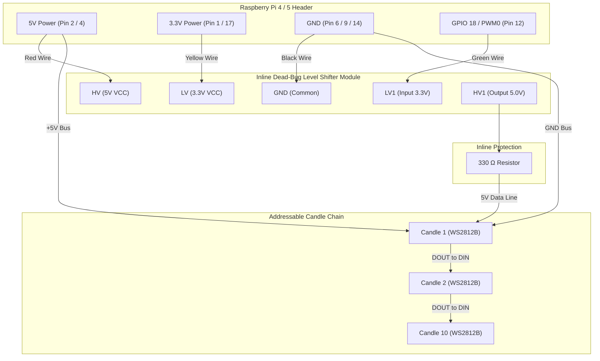

# Individually Addressable LED Candles — Inline "Dead Bug" Wiring Guide

This guide details the wiring and assembly for individually addressable **WS2812B LED candles** driven by a Raspberry Pi 4/5, using an inline **"Dead Bug" soldered logic level shifter** to step up the Raspberry Pi's 3.3V GPIO signal to 5.0V logic.

---

## 🛒 Bill of Materials & Hardware Components

| Component | Description | Amazon Link |
|---|---|---|
| **Addressable LEDs** | BTF-LIGHTING WS2812B Pre-Soldered / Diffused 5V RGB LEDs | [Amazon Product Link](https://www.amazon.com/dp/B07C1XGD1X?ref=ppx_yo2ov_dt_b_fed_asin_title&th=1) |
| **Level Shifter** | 3.3V to 5V Bi-Directional Logic Level Converter Module | [Amazon Product Link](https://www.amazon.com/dp/B08R6BCSYC?ref=ppx_yo2ov_dt_b_fed_asin_title) |
| **Protection Resistor** | 330 Ω 1/4W Resistor (placed inline on 5V Data line) | Standard Electronic Component |
| **Capacitor** | 1000 µF 10V/16V Electrolytic Capacitor (across 5V & GND near Pi) | Optional / Recommended |
| **Heat Shrink** | 2mm & 6mm Dual-Wall Adhesive Heat Shrink Tubing | Standard Hardware |

---

## 🪲 What is "Dead Bug" Wiring?

A **"Dead Bug"** setup means soldering wires directly to the pins of the tiny logic level converter module with its component pins pointing upward (resembling an upside-down dead bug), insulated with heat-shrink tubing, and embedded directly inside the wire harness. 

### Why Use Dead Bug Wiring for the Skull?
* **Zero Space Impact**: Eliminates bulky breadboards or extra PCBs inside the skull chassis.
* **Inline Protection**: Allows the level shifter to sit invisibly inside the wire loom between the Pi GPIO header and the candle harness.

---

## 🔌 Complete Wiring Pinout Table

### 1. Raspberry Pi ➔ Level Converter ("Dead Bug" Module)

| Raspberry Pi Pin | Function | Level Converter Pin | Wire Color | Notes |
|---|---|---|---|---|
| **Pin 2 or Pin 4** | **5V Power** | **HV** (High Voltage VCC) | Red | 5V Rail |
| **Pin 17** | **3.3V Power** | **LV** (Low Voltage VCC) | Orange / Yellow | **Dedicated 3.3V for Shifter** (Pin 1 is for Laser Rangefinder) |
| **Pin 9 or Pin 14** | **Ground (GND)** | **GND** (Common Ground) | Black / White | Common Ground |
| **Pin 12 (GPIO 18 / PWM0)** | **3.3V Data Signal** | **LV1** (Low Voltage Input) | Blue / Green | Dedicated PWM Data Pin |

> [!TIP]
> **No Pin Collision with Laser Rangefinder**:
> - The **Laser Rangefinder** uses **Pin 1 (3.3V)**, **Pin 3 (GPIO 2 / SDA)**, **Pin 5 (GPIO 3 / SCL)**, and **Pin 7 (GPIO 4 / XSHUT)**.
> - The **Dead Bug Shifter** uses **Pin 17 (3.3V)**, **Pin 2 (5V)**, **Pin 9 (GND)**, and **Pin 12 (GPIO 18 / PWM0)**.
> - Using **Pin 17** for the shifter keeps both components completely separate without needing wire splices!

### 2. Level Converter ➔ WS2812B Candle LED Chain

| Level Converter Output Pin | Connection | Destination |
|---|---|---|
| **HV1** (High Voltage Output) | 330 Ω Resistor ➔ | **DIN** (Data In) of **Candle 1** |
| **HV** (5V Rail Pass-through) | Direct ➔ | **+5V** (VCC) of **ALL Candles** (Parallel Bus) |
| **GND** (Ground Pass-through) | Direct ➔ | **GND** of **ALL Candles** (Parallel Bus) |

### 3. Daisy-Chaining Candle LEDs in Series (Data Line)

| Source LED | Signal Out | Destination LED | Signal In |
|---|---|---|---|
| **Candle 1** | **DOUT** (Data Out) | ➔ **Candle 2** | **DIN** (Data In) |
| **Candle 2** | **DOUT** (Data Out) | ➔ **Candle 3** | **DIN** (Data In) |
| **...** | **...** | ➔ **...** | **...** |
| **Candle 9** | **DOUT** (Data Out) | ➔ **Candle 10** | **DIN** (Data In) |

> [!IMPORTANT]
> - Power (`+5V`) and **GND** are wired in **parallel** to all 10 candle LEDs.
> - Data (`DIN` / `DOUT`) is wired in **series** (daisy-chained) from Candle 1 through Candle 10.

---

## 📐 Circuit Schematic Diagram



---

## 🛠️ Step-by-Step "Dead Bug" Assembly Instructions

### Step 1: Prepare the Level Shifter Module
1. Place the Level Converter module upside down (pins sticking up like a dead bug).
2. Tin all required pin pads (`HV`, `LV`, `GND`, `LV1`, `HV1`) with a small dab of solder.

### Step 2: Solder the Input Side (Raspberry Pi Wires)
1. Solder a **Red wire** from Raspberry Pi **5V (Pin 2)** to the **HV** pin.
2. Solder an **Orange/Yellow wire** from Raspberry Pi **3.3V (Pin 1)** to the **LV** pin.
3. Solder a **Black wire** from Raspberry Pi **GND (Pin 6)** to the **GND** pin.
4. Solder a **Green wire** from Raspberry Pi **GPIO 18 (Pin 12)** to the **LV1** input pin.

### Step 3: Solder the Output Side & Inline Resistor
1. Solder one leg of the **330 Ω resistor** directly to the **HV1** output pin.
2. Solder the data wire going to **Candle 1 (DIN)** to the other leg of the 330 Ω resistor.
3. Solder the **+5V** power wire for Candle 1 directly to the **HV** pin.
4. Solder the **GND** wire for Candle 1 directly to the **GND** pin.

### Step 4: Insulate the "Dead Bug"
1. Slide individual 2mm heat-shrink sleeves over each exposed solder joint and resistor leg.
2. Slide a single 6mm or 8mm piece of heat-shrink tubing over the entire level shifter assembly and shrink it with a heat gun to create a rugged, sealed, inline pod.

### Step 5: Daisy-Chain the Candle LEDs
1. Mount the 10 WS2812B LEDs into the candle stem positions.
2. Connect `+5V` and `GND` from the main power harness to every LED.
3. Connect `DOUT` of Candle 1 to `DIN` of Candle 2, `DOUT` of Candle 2 to `DIN` of Candle 3, continuing up to Candle 10.

---

## 💻 Software & Driver Configuration

To drive the WS2812B candles from Python on the Pi:

### Install Dependencies
```bash
pip install rpi-ws281x
```

### Python Code Snippet (`skull/candles.py`)
```python
import time
import math
import random
from rpi_ws281x import PixelStrip, Color

LED_COUNT      = 10      # Number of candle LEDs
LED_PIN        = 18      # GPIO pin connected to LV1 (Pin 12 / PWM0)
LED_FREQ_HZ    = 800000  # WS2812B signal frequency (800kHz)
LED_DMA        = 10      # DMA channel
LED_BRIGHTNESS = 255     # Max brightness (0-255)
LED_INVERT     = False   # False for non-inverting level shifter

strip = PixelStrip(LED_COUNT, LED_PIN, LED_FREQ_HZ, LED_DMA, LED_INVERT, LED_BRIGHTNESS)
strip.begin()

def organic_flicker_loop():
    speeds = [random.uniform(0.06, 0.14) for _ in range(LED_COUNT)]
    offsets = [random.uniform(0, 100) for _ in range(LED_COUNT)]
    
    while True:
        t = time.time()
        for i in range(LED_COUNT):
            # Calculate organic flame flicker wave
            flicker = 0.5 + 0.3 * math.sin(t * speeds[i] * 40 + offsets[i]) + 0.2 * math.sin(t * speeds[i] * 110)
            
            # Flame color mixing (Warm Amber / Gold)
            r = int(max(100, min(255, 180 + flicker * 75)))
            g = int(max(20, min(120, 40 + flicker * 40)))
            b = 0 # No blue in candle flames
            
            strip.setPixelColor(i, Color(r, g, b))
        
        strip.show()
        time.sleep(0.025) # ~40 FPS refresh
```

---

## 🔍 Verification & Troubleshooting Checklist

- [ ] **Data Direction**: Verify `DIN` is connected to `HV1` of the shifter, NOT `DOUT`.
- [ ] **Common Ground**: Ensure Raspberry Pi GND, Level Shifter GND, and LED GND are all tied together to a single common ground.
- [ ] **Power Capacity**: Each WS2812B LED draws up to ~60mA at full white. For 10 candles, max current is ~600mA, which the Pi 5V header pins can safely supply.
- [ ] **GPIO Selection**: GPIO 18 (Pin 12) is recommended as it supports hardware PWM without CPU jitter.
