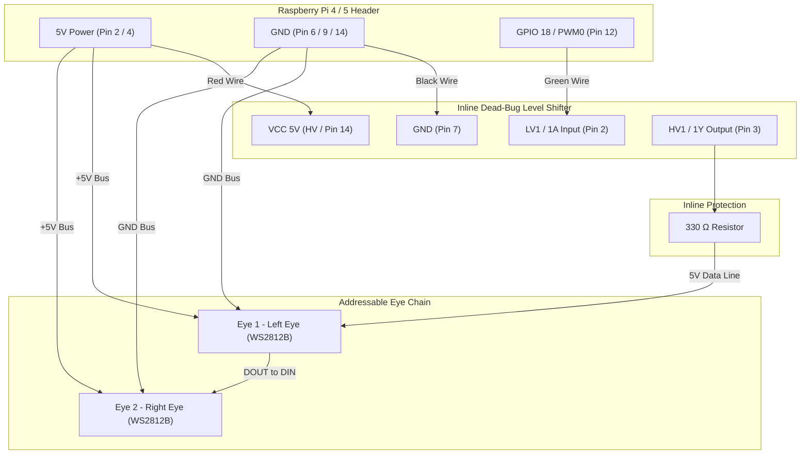

# 2× Individually Addressable LED Eyes — Inline "Dead Bug" Wiring Guide

This guide details the wiring and assembly for **2 individually addressable WS2812B RGB LED eyes** driven by a Raspberry Pi 4/5, using an inline **"Dead Bug" soldered logic level shifter** to step up the Raspberry Pi's 3.3V GPIO signal to 5.0V logic.

> [!NOTE]
> Moving from 3 LEDs to 2 LEDs accounts for the 3rd lens housing being dedicated to the mounted camera. The two remaining eye lenses (Left Eye = Index 0, Right Eye = Index 1) are individually addressable over a single GPIO data line.

---

## 🛒 Bill of Materials & Hardware Components

| Component | Description | Amazon / Part Link |
|---|---|---|
| **Addressable LEDs** | BTF-LIGHTING WS2812B Pre-Soldered / Diffused 5V RGB LEDs | [Amazon Product Link](https://www.amazon.com/dp/B07C1XGD1X) |
| **Level Shifter** | 3.3V to 5V Bi-Directional Logic Level Converter Module | [Amazon Product Link](https://www.amazon.com/dp/B08R6BCSYC) |
| **Protection Resistor** | 330 Ω 1/4W Resistor (placed inline on 5V Data line) | Standard Electronic Component |
| **Capacitor** | 100 µF to 1000 µF 10V/16V Electrolytic Capacitor (across 5V & GND near Pi) | Optional / Recommended |
| **Heat Shrink** | 2mm & 6mm Dual-Wall Adhesive Heat Shrink Tubing | Standard Hardware |

---

## 🪲 What is "Dead Bug" Wiring?

A **"Dead Bug"** setup means soldering wires directly to the pins of the tiny logic level converter module with its component pins pointing upward (resembling an upside-down dead bug), insulated with heat-shrink tubing, and embedded directly inside the wire harness.

### Why Use Dead Bug Wiring for the Skull?
* **Zero Space Impact**: Eliminates bulky breadboards or extra PCBs inside the skull chassis.
* **Inline Protection**: Allows the level shifter to sit invisibly inside the wire loom between the Pi GPIO header and the eye LED harness.

---

## 📌 Level Converter Pinouts & Dead-Bug Connection Maps

Depending on whether your setup uses the **4-Channel MOSFET Breakout Module** (`B08R6BCSYC`) or the **SN74AHCT125N IC**, use the corresponding pinout map below.

### Option A: 4-Channel MOSFET Breakout Module (`B08R6BCSYC`)

| (1) Pi Pin # | (2) Level Shifter Pin (3.3V Side) | (3) Level Shifter Pin (5.0V Side) | (4) Wire Color / Destination |
|---|---|---|---|
| Pin 2 or 4 | — | **HV** | Red / 5V Power Rail (Level Shifter & LEDs) |
| Pin 1 or 17 | **LV** | — | Orange / 3.3V Power Reference |
| Pin 6, 9, or 14 | **GND** | **GND** | Black / Common Ground Rail |
| Pin 12 (GPIO 18) | **LV1** (Data In) | **HV1** (Data Out) | Green ➔ **330 Ω Resistor** ➔ **Eye 1 DIN** |

---

### Option B: SN74AHCT125N DIP-14 IC (Dead-Bug Solder Map)

If using the **SN74AHCT125N** high-speed 3.3V-to-5.0V bus buffer IC in DIP-14 format, use the following pinout and dead-bug connection map:

#### DIP-14 Package Pinout Diagram

```text
               SN74AHCT125N DIP-14 Top View
                     ┌───┬───┐
(GND Enable 1)  1OE 1│●  └── │14 VCC (5V Power)
(3.3V Data IN)   1A 2│       │13 4OE (Tie to GND)
(5V Data OUT)    1Y 3│       │12 4A  (Unused)
(Tie to GND)    2OE 4│       │11 4Y  (Unused)
(Unused)         2A 5│       │10 3OE (Tie to GND)
(Unused)         2Y 6│       │9  3A  (Unused)
(Ground)        GND 7│       │8  3Y  (Unused)
                     └───────┘
```

#### SN74AHCT125N Dead-Bug Pin Connection Table

| (1) Pi Pin # | (2) Dead Bug Pin # | (3) Dead Bug Pin Name | (4) Selected Wire Color / Destination |
|---|---|---|---|
| Pin 2 or 4 | Pin 14 | VCC | Red / Pi 5V & LED 5V Bus |
| Pin 9 or 14 | Pin 7 | GND | Black / Pi GND & LED GND Bus |
| — | Pin 1 | 1OE | Bare Solder Bridge (Pin 7) |
| Pin 12 (GPIO 18) | Pin 2 | 1A | Green / 3.3V Data Line |
| Eye 1 DIN | Pin 3 | 1Y | White (via 330 Ω resistor) |
| — | Pins 4, 10, 13 | 2OE, 3OE, 4OE | Bare Solder Bridge (Pin 7) |
| — | Pins 5, 6, 8, 9, 11, 12 | 2A, 2Y, 3A, 3Y, 4A, 4Y | None |

---

## 💡 Resistor Location & Signal Clarification

### 1. Where Does the 330 Ω Resistor Go?
> [!IMPORTANT]
> The **330 Ω resistor is placed ONLY on the 5.0V Data Output line** (`1Y` on the IC / `HV1` on the module), **BEFORE Eye 1's `DIN` pin**.
> - **Input Side (3.3V)**: Connect Raspberry Pi GPIO 18 (Pin 12) **directly** to Data Input (`1A` on the IC / `LV1` on the breakout module). **No resistor is used on the 3.3V input side.**
> - **Output Side (5.0V)**: Connect Data Output (`1Y` / `HV1`) ➔ **330 Ω Resistor** ➔ **Eye 1 DIN**. (This dampens signal reflections and protects the first LED).

### 2. Why Does Breakout Module Have `LV (3.3V VCC)` While SN74AHCT125N Does Not?
- **4-Channel MOSFET Breakout Module**: Requires a 3.3V power reference wire connected to its `LV` pin to bias internal transistors.
- **SN74AHCT125N IC Chip**: Powered **exclusively by 5.0V `VCC` (Pin 14)**. It has TTL-compatible input thresholds ($V_{IH} \ge 2.0\text{V}$), so it recognizes 3.3V GPIO data signals on Pin 2 (`1A`) directly **without needing any 3.3V power wire!**

---

## 🔌 Complete Wiring Pinout Table

### 1. Level Converter ➔ WS2812B Eye LED Harness

| Level Converter Output Pin | Connection | Destination |
|---|---|---|
| **Pin 3 (1Y / HV1 Data Out)** | 330 Ω Resistor ➔ | **DIN** (Data In) of **Eye 1 (Left Eye)** |
| **Pin 14 (5V Rail Pass-through)** | Direct ➔ | **+5V** (VCC) of **ALL Eye LEDs** (Parallel Bus) |
| **Pin 7 (GND Pass-through)** | Direct ➔ | **GND** of **ALL Eye LEDs** (Parallel Bus) |

### 2. Daisy-Chaining Eye LEDs in Series (Data Line)

| Source LED | Signal Out | Destination LED | Signal In |
|---|---|---|---|
| **Eye 1 (Left Eye - Index 0)** | **DOUT** (Data Out) | ➔ **Eye 2 (Right Eye - Index 1)** | **DIN** (Data In) |

> [!IMPORTANT]
> - Power (`+5V`) and **GND** are wired in **parallel** to both Eye LEDs.
> - Data (`DIN` / `DOUT`) is wired in **series** (daisy-chained) from Eye 1 through Eye 2.

---

## 📐 Circuit Schematic Diagram



---

## 🛠️ Step-by-Step "Dead Bug" Assembly Instructions

### Step 1: Prepare the Level Converter
1. For breakout module: Solder header wires directly to `HV`, `LV`, `GND`, `LV1`, and `HV1`.
2. For SN74AHCT125N IC: Place chip upside down (pins sticking up like a dead bug) and solder bridge enable pins `1OE` (Pin 1), `2OE` (Pin 4), `3OE` (Pin 10), and `4OE` (Pin 13) directly to `GND` (Pin 7).

### Step 2: Solder the Input Side
1. Solder a **Red wire** from Raspberry Pi **5V (Pin 2 or 4)** to **HV / Pin 14 (VCC)**.
2. Solder a **Black wire** from Raspberry Pi **GND (Pin 6, 9, or 14)** to **GND / Pin 7 (GND)**.
3. Solder a **Green wire** from Raspberry Pi **GPIO 18 (Pin 12)** to **LV1 / Pin 2 (1A)**.

### Step 3: Solder Output Side & Inline Resistor
1. Solder one leg of the **330 Ω resistor** directly to **HV1 / Pin 3 (1Y)**.
2. Solder the data wire going to **Eye 1 (DIN)** to the other leg of the 330 Ω resistor.
3. Solder the **+5V** power wire for Eye 1 directly to the **HV / Pin 14** rail.
4. Solder the **GND** wire for Eye 1 directly to the **GND / Pin 7** rail.

### Step 4: Insulate the "Dead Bug"
1. Slide individual 2mm heat-shrink sleeves over each exposed solder joint and resistor leg.
2. Slide a single 6mm or 8mm piece of dual-wall heat-shrink tubing over the entire level shifter assembly and shrink it with a heat gun to create a sealed inline pod.

### Step 5: Mount & Daisy-Chain the Eye LEDs
1. Mount Eye 1 into the Left Eye lens position and Eye 2 into the Right Eye lens position.
2. Connect `+5V` and `GND` from the harness to both LEDs in parallel.
3. Connect `DOUT` of Eye 1 to `DIN` of Eye 2.

---

## 💻 Software & Driver Configuration

### Environment Variables (`.env`)
```bash
EYE_LED_PIN=18
EYE_LED_COUNT=2
```

### Driver Integration (`core/eyes.py`)
```python
import time
import math
from rpi_ws281x import PixelStrip, Color

# Initialize 2 WS2812B eye LEDs on GPIO 18 (PWM0)
strip = PixelStrip(2, 18, 800000, 10, False, 255, 0)
strip.begin()

def set_eye_color(r, g, b):
    for i in range(2):
        strip.setPixelColor(i, Color(r, g, b))
    strip.show()

# Set Grimdark Crimson Red
set_eye_color(255, 0, 0)
```

---

## 🔍 Verification & Troubleshooting Checklist

- [ ] **Data Direction**: Verify `DIN` of Eye 1 is connected to `HV1` (after 330 Ω resistor), NOT `DOUT`.
- [ ] **Common Ground**: Ensure Raspberry Pi GND, Level Shifter GND, and LED GND are all tied together to a single common ground.
- [ ] **GPIO Selection**: GPIO 18 (Pin 12) is recommended as it supports hardware PWM0 without CPU timing jitter.
- [ ] **Resistor Placement**: 330 Ω resistor must be placed on the 5.0V output data line (`HV1` ➔ `DIN`), NOT on the 3.3V input side.
