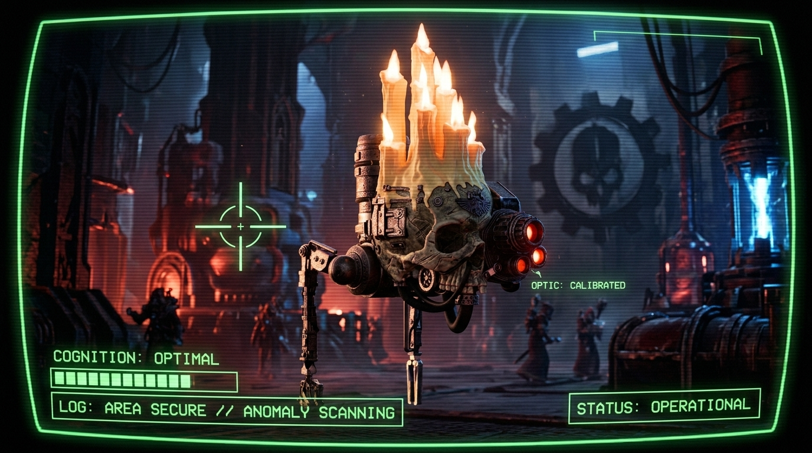

# Omega-7 — The Servo Skull Assistant

<p align="center">
  
</p>

<p align="center">
  <a href="#-what-it-does"></a>
  <a href="#-what-it-does"></a>
  <a href="#-tabletop-game-context--dice-simulator"></a>
</p>

> *"This unit serves the Omnissiah, and, in its infinite mercy, you."*

---

An AI-powered **Warhammer 40,000 servo skull** that floats on your shelf, glares at you with glowing red optics, ignites its own candle flames when it wakes, and answers you out loud — in character as an ancient, Emperor-devoted machine-spirit. 

Powered by a **Raspberry Pi 5**, Omega-7 sees you through an autofocus camera, hears you through an embedded microphone, and speaks through a real voice. It knows tabletop rulebooks cold, plays music via Spotify Connect, monitors your 3D printer, simulates specialized dice rolls, and remembers your preferences.

Simply speak the wake phrase — **"Servitor"** — and it wakes, ignites its top-mounted candle LEDs, pulses its eye iris in time with its voice, and responds.

---

## ⚡ Key Capabilities

| Capability | Description |
| :--- | :--- |
| **🗣️ In-Character Voice AI** | Wakes to *"Servitor"*, processing queries with Anthropic Claude and speaking aloud via local Piper or ElevenLabs text-to-speech. Formal, archaic, and devoted to the Emperor. |
| **👁️ Computer Vision & Biometrics** | Arducam IMX708 autofocus camera for scene description (*"What do you see?"*), SFace facial recognition, and GMM voice profile identification. |
| **💡 Physical Eye HUD & Candle LEDs** | GC9A01 1.28" circular IPS panel "machine-spirit eye" with 6 dynamic HUD animation states and 30 screensavers. Transistor-switched flame LEDs ignite on wake and extinguish on sleep. |
| **📖 Offline Tabletop Rules Engine** | Instant lookup for **Warhammer 40,000 (11th ed.)**, **Necromunda**, **NetEpic**, and **Net Epic Armageddon** datasheets, stratagems, weapon traits, and points. |
| **🎲 Tabletop Dice Simulator** | Intercepts dice requests (standard, firepower, injury, scatter, order, save) with sound effects and projects vector-drawn alphanumeric outcomes directly onto the eye HUD. |
| **🖨️ Bambu Lab 3D Printer Telemetry** | Secure local MQTT client monitoring active print progress, nozzle/bed temperatures, and vocalizing diagnostic HMS fault warnings. |
| **🎵 Spotify & Bluetooth Control** | Hands-free music playback, volume adjustment, and Bluetooth speaker discovery/pairing. |
| **🧠 Proactive Memory & Reminders** | Remembers facts across conversations, tracks personal preferences, maintains drifting personality states, and delivers daily morning briefings (weather + news). |
| **🌐 Adeptus Mechanicus Web Remote** | A retro green CRT web remote running securely over HTTPS on port 8080 with live telemetry, video feed mirror, and mic streaming. |

---

## 🌐 Adeptus Mechanicus Web Remote (Port 8080)

Omega-7 hosts a responsive, green-phosphor CRT tactical display accessible securely over HTTPS.

### Remote Features:
- **Ocular Feed Mirror**: Real-time MJPEG stream mirroring the physical circular GC9A01 eye screen (HUD states, screensavers, cog rotation, and artwork projections).
- **Secure Audio Capture**: Capture and stream browser microphone audio (WAV PCM 16kHz) securely over the network.
- **2-Column Telemetry Panel**: Live system monitor detailing CPU load, Core Temperature, RAM, Storage, Printer status, Master, Silent Mode, and Active Game in a clean dual-column grid.
- **Vox Log Channel**: Live streaming transcript of all verbal interactions between the Master and Omega-7.
- **Remote Commands & Visual Emulation**: Inject direct text commands or trigger any of the 30 visual screensavers on demand.

---

## 👁️ Machine-Spirit Eye HUD & Animations

<p align="center">
  
</p>

The circular GC9A01 IPS panel serves as Omega-7's main visual feedback element, dynamically updating across multiple states:

- **Praise the Omnissiah Logo**: High-contrast Mechanicus skull-cog vector rendering expanding on boot and code updates.
- **Auspex Scan**: Concentric Noosphere beacon pulsing waves mapping surroundings.
- **Targeting Lock-On**: Floating crosshair tracking target focus during vision queries.
- **Equalizer Visualizer**: Bouncing frequency bars synchronized to Spotify playback.
- **Cogitation Gear**: Rotating bezel cog wheel spinning at 80°/sec during brain processing.
- **Vector Digit Projector**: High-tech segment lines drawing physical dice values.
- **Artwork Projector**: Direct DeviantArt RSS search fetching and displaying 40k and Necromunda fan art inside the mechanical lens aperture.

---

## 🗣️ Verbal Command Quick Reference

<details>
<summary><b>🎵 Music & Audio Control (Spotify & Bluetooth)</b></summary>

- **Play Music**: *"Play [song/artist/playlist]"*, *"Play Warhammer soundtrack"*
- **Playback**: *"Pause"*, *"Resume"*, *"Skip track"*
- **System Volume**: *"Set volume to 80"*, *"Louder"*, *"Quieter"*
- **Spotify Volume**: *"Set Spotify volume to 50"*
- **Bluetooth Pairing**: *"Scan for Bluetooth speakers"*, *"Connect to speaker [name/number]"*
</details>

<details>
<summary><b>🎲 Tabletop Dice Roller & Rules Lookup</b></summary>

- **Standard Dice**: *"Roll 2d6"*, *"Roll a d20"*, *"Roll three d10s"*
- **Necromunda Special Dice**: *"Roll a Necromunda injury dice"*, *"Roll firepower"*, *"Roll scatter"*
- **Active Game Setting**: *"Set active game to Necromunda"*, *"We are playing Warhammer 40k"*
- **Warhammer 40,000**: *"What does [Ability/Stratagem] do?"*, *"Look up [Unit Name] stats"*
- **Necromunda**: *"What are the rules for [Weapon Trait/Skill]?"*, *"Look up Trading Post cost for plasma pistol"*
</details>

<details>
<summary><b>👁️ Vision, Biometrics & 3D Printer Monitor</b></summary>

- **Describe Scene**: *"What do you see?"*, *"Describe the room"*
- **Biometric Calibration**: *"Register my face as [Name]"*, *"Calibrate your eye for [Name]"*
- **3D Printer Status**: *"What is the printer doing?"*, *"Check 3D printer status"*
- **Alert Suppression**: *"Acknowledged. Cancel the alerts."*
</details>

<details>
<summary><b>🖥️ Visual Screensavers & Artwork Projection</b></summary>

- **Trigger Screensaver**: *"Play the [screensaver_name] screensaver"*
  - *Available*: `canticle_rain`, `pong`, `starfield`, `oscilloscope`, `game_of_life`, `radar`, `warp_core`, `mandala`, `rune_wheel`, `glitch`, `dna_helix`, `neural_net`, `hex_grid`, `void_shield`, `particle_burst`, and more.
- **Project Artwork**: *"Display artwork of [Space Marine / Gang Name]"*
</details>

<details>
<summary><b>🧠 Reminders, Memory & System Operations</b></summary>

- **Reminders**: *"Remind me to check the stove in 20 minutes"*, *"What are my reminders?"*
- **Store Memory**: *"Remember that I play House Van Saar"*
- **Purge Biometrics**: *"Purge your memory of [Name]"*
- **System Commands**: *"Reboot system"*, *"Power off"*, *"Self update"*
</details>

---

## 🛠️ Build Your Own

Complete step-by-step documentation is included in the repository:

1. **Bill of Materials — [`SHOPPING_LIST.txt`](SHOPPING_LIST.txt)**
   - Complete hardware checklist (~$157 total for electronics).
   - Designed around the **[Servo Skull LED Candlelit Lantern 3D model](https://www.printables.com/model/1457078-servo-skull-led-candlelit-lantern)**.
   - Highlights: Raspberry Pi 5 (4GB), Official Active Cooler, 27W Power Supply, GC9A01 1.28" IPS Display, Arducam IMX708, UGREEN USB Sound Card, Candle LEDs.

2. **Step-by-Step Installation — [`PI_SETUP_GUIDE.md`](PI_SETUP_GUIDE.md)**
   - Full OS flashing, annotated GPIO pinout diagrams, one-shot installer (`pi_setup.sh`), PipeWire audio routing setup, and assembly guide.

---

## 📁 Repository Layout

```
skull/                 Python application package
  main.py              Wake-word loop & orchestration
  brain.py             Claude conversation & tool dispatch
  llm.py               Anthropic API client
  wake_word.py         openWakeWord engine ("Servitor")
  transcribe.py        Whisper speech-to-text
  tts.py               Piper & ElevenLabs voice engine
  audio.py             PipeWire audio capture & playback
  camera.py            IMX708 vision & SFace facial recognition
  eyes.py              GPIO eye LEDs & candle transistor control
  display.py           GC9A01 circular display driver & HUD engines
  spotify_ctrl.py      Spotify Connect integration
  bambu_ctrl.py        Bambu Lab 3D printer MQTT client
  web.py               Adeptus Mechanicus HTTPS Web Remote (Port 8080)
  memory.py / mood.py  Persistent memory & drifting personality state
  config.py            Single source of truth configuration

emulator/              Mac/Windows desktop visual emulator (no hardware needed)
Rules/                 Offline rules database (40k, Necromunda, NetEpic, NetEA)
pi_setup.sh            One-shot Pi installer & service setup
omega7.service         systemd service descriptor
```

---

## 📜 Requirements & Licensing

- **Hardware:** Raspberry Pi 5 (4 GB) + components listed in [`SHOPPING_LIST.txt`](SHOPPING_LIST.txt).
- **OS:** Raspberry Pi OS 64-bit (Debian *Trixie*, Python 3.13, PipeWire).
- **API Keys:** Anthropic Claude (required); OpenAI, ElevenLabs, Spotify (optional).

*The Omnissiah smiles upon a clean install. Praise the Machine God.*
